# Next.js + WordPress as headless CMS

Do you want to edit the content of your apps without touching a single line of code?😯 

In this tutorial we'll explore **Next.js, one of the best performing front end web frameworks 🚀**, and **WordPress, the most popular open source software for creating websites**. 

What other things are you gonna learn?:

✔️ How to **connect** Next.js and WordPress

✔️ How to correctly **retrieve data in Next.js** to make use of **Static Site Generation** (SSG) and **Incremental Static Regeneration** (ISR)

✔️ How to **set up WordPress on a subdomain** and **expose its data** on API endpoints.

✔️ All the steps required to get a **production app deployed to Vercel** on a **custom domain name**, so you have the recipe to deliver apps to your clients.🔥🔥

To learn all the things mentioned above, we're gonna build this demo app: ------demo app url here----------

👉 Big thanks to Gonzalo Aguirre, from Underscope, a React Native company based in South America, for reviewing this tutorial.

This tutorial shows the technologies and steps taken to deliver this app (not finished yet) https://www.sportslink.info/ to a client in Germany🇩🇪


Table of contents:

Intro:

-What is Next.js?

-What is SSG & ISG?

-What is WordPress?

-What is a headless CMS?

-The WordPress REST API


Demo app:

-Demo app overview

-Buying a domain

-Seting up WordPress on a subdomain

-Adding data to WordPress

​	-Adding new posts

​	-Adding custom data

-Next.js blog demo app

-Deploying to vercel

-Connecting the main domain to vercel

-Testing SSG and ISG


Conclusion:


## What is Next.js?

According the creators (https://nextjs.org/).: 

*Is the React framework from production.*

*Next.js gives you the best developer experience with all the features you need for production: hybrid static & server rendering, TypeScript support, smart bundling, route pre-fetching, and more. No config needed.*

There are tons of benefits for chosing Next.js over just React, and one of the main ones is getting good SEO, because the pages of the app that are loaded in the browser are already pre-rendered in the server side. 

If this is the first time you're hearing about this framework, take a look at this nice tutorial: https://nextjs.org/learn/basics/create-nextjs-app?utm_source=next-site&utm_medium=homepage-cta&utm_campaign=next-website

If you wanna dive deeper, check out these Academind courses:

-https://www.youtube.com/watch?v=MFuwkrseXVE&ab_channel=Academind (for FREE!)

-https://pro.academind.com/p/nextjs-react-the-complete-guide


## What is SSG and ISR

**SSG stands for Static Site Generation.** This means that some or all the pages of the app are pre-rendered at build time, and are stored and delivered as static assets (JS, CSS and HTML files) to the browser. This is the philosophy of JamStack apps (https://jamstack.org/) which are the present and the future of web apps.

Let's think together: if the app is pre-rendered at build time, the app fetches data from their APIs and Next.js generates the html with that data. But...what happens if later on, the data from the API changes?

Do we need to run a new build of the app to create fresh html so users see the new data when they load the app? Thankfully, Next.js provides a solution for us: **Incremental Site Regeneration (ISR)**.

According to the docs (https://nextjs.org/docs/basic-features/data-fetching#incremental-static-regeneration):

*Next.js allows you to create or update static pages **after** you’ve built your site. Incremental Static Regeneration (ISR) enables you to use static-generation on a per-page basis, **without needing to rebuild the entire site**. With ISR, you can retain the benefits of static while scaling to millions of pages.*

We'll explore how to make use of these tools in later sections, when we'll build a demo app.


## What is WordPress?

According to them (https://wordpress.org/), *WordPress is open source software you can use to create a beautiful website, blog, or app.*

Let's look at some numbers to see how used is this software in the real world:

*WordPress is now **powering 39.5% of all websites in 2021**, up from powering 35% of sites in 2020. Counting only sites that use a content management system (CMS), WordPress has a market share of 64.1%.* (source: https://www.searchenginejournal.com)

Why not using the most popular tech to build an app? Using something mainstream has the advantage of getting good support, tons of answered questions online, and besides that, it can be hosted in a server at a really low cost.

In a nutshell, WordPress is a bunch of PHP files and MySQL databases, installed on a Linux server, usin **Apache** (the most commonly used Web server on **Linux** systems).  This software can be used to store data and create html pages that users can interact with.

Note: WordPress can also run on Windows and Mac, and this is the case when developing wordpress sites locally. Then, when on production, most web servers use Linux.


## What is a Headless CMS?

A headless CMS (Content Management System) is using just using the back end part of a full stack app, that can expose functionality and data through  REST or GraphQL endpoints (urls).

So, **instead of using WordPress for storing data and creating the html, we just only use it for storing data, and then we use Next.js to create the html instead and be in charge of the front end part of the app.**


## The WordPress REST API:

The WordPress REST API provides an interface for applications to interact with your WordPress back end by sending and receiving data as [JSON](https://en.wikipedia.org/wiki/JSON) (JavaScript Object Notation) objects.(https://developer.wordpress.org/rest-api/).

So this API are a bunch of urls we can hit to access data stored in WordPress from any type of app that can make http requests. In our case, it will be Next.js making requests to this API.

To make things more clear, let's look at the some of the available endpoints available by default (https://developer.wordpress.org/rest-api/reference/):

-/wp/v2/posts

-/wp/v2/media

Let's now look for a famous website that uses WordPress: https://www.bbcamerica.com/ and try to access data that they have stored in the back end of the wordpress software.

To access the endpoints of the REST API, all we need to do is to make an http request to `{domain}/wp-json/{endpoint}`. For example, try navigating to this url: https://www.bbcamerica.com/wp-json/wp/v2/media to see all the images the BBC America has stored on WordPress. Pretty awesome, insn't it?

The response we get when hitting the above url has this shape: [{},{},..]

It's basically an array with objects inside, that have links to pictures (like this one:https://images.amcnetworks.com/bbcamerica.com/wp-content/uploads/2021/05/Colin-Farrell-300x169.jpg), which are part of the `media` collection in the back end.

BBC America has decided to use WordPress as a full stack app, because besides using it to store data, it's being used to generate the html that users see when hitting https://www.bbcamerica.com/, but they can also use a front end framework like Next.js in the future, to provide users with faster navigation and better user experience if they want to, just by using the REST API already in place.


## Demo app overview

Enough of theory. 

Let's now build a Next.js app and connect it to a WordPress back end, so you can see the full potential of this tech stack combo. The Next.js app is deployed here: ------Deployed app url-------, and the WordPress back end is installed here: -------------Subdomain here-----------.

The Next.js app displays tech blog posts and events, and it uses SSG and ISR technology, deployed on Vercel (https://vercel.com/).


## Buying  a domain

As this tutorial is about deploying an app to custom domain, let's start by buying one.

There are tons of places where we can buy a domain name. Feel free to explore for hosting services + domain providers. You can check out a list of them here: https://www.wpbeginner.com/wordpress-hosting/

In this article we'll use Siteground (https://www.siteground.co.uk/) to buy domain name and use their wordpress hosting service, all in one package.

There are many plans (https://www.siteground.co.uk/wordpress-hosting.htm):

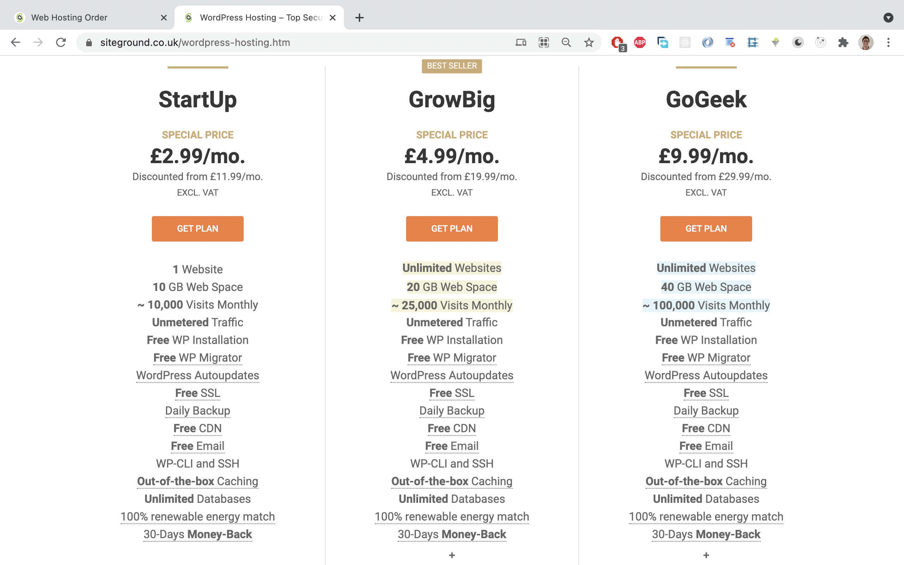


Then, when checking out, you can buy a domain name:

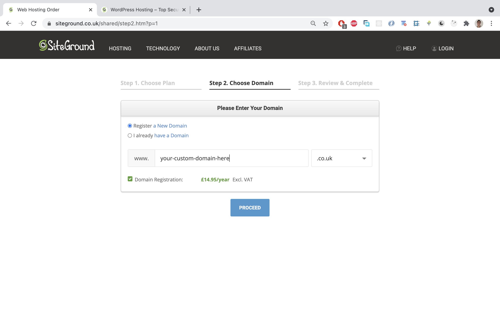


## Seting up WordPress on a subdomain

After finishing the purchase, the next step is to create a subdomain, but...why?

The idea is to buy a domain name, e.g `sportslink.info`, and then **create a subdomain to install WordPress there**, e.g `my-wordpress.sportslink.info`, and use the main domain `sportslink.info` on Vercel, to display the Next.js front end app.

Using a subdomain has the benefit of **"pay once, use twice"** approach because **the subdomain it's for free**. You can have as many subdomains as you want. There is no point on buying one domain name for the backend (WordPress) and another domain for the front end (Next.js app).

Here are the steps to create a subdomain:

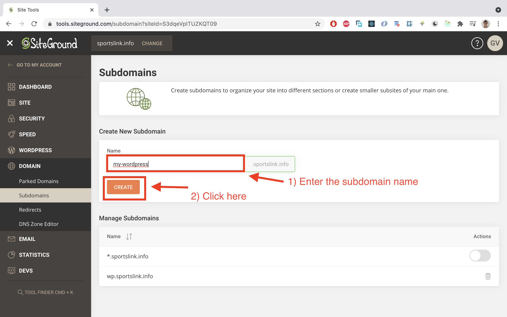


As you can see, there was an already created subdomain `wp`, which is beeing used in production for this app https://www.sportslink.info/. The new subdomain is called `my-wordpress`.


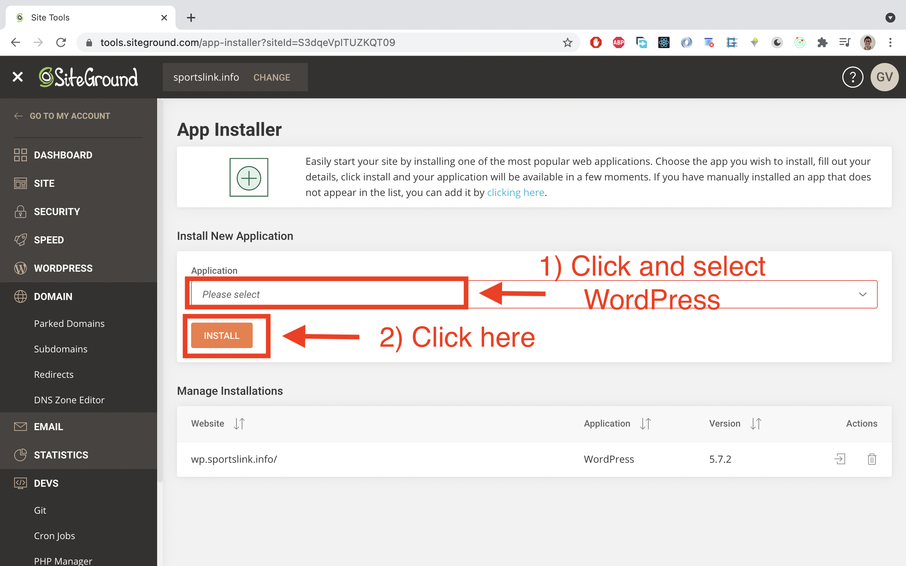


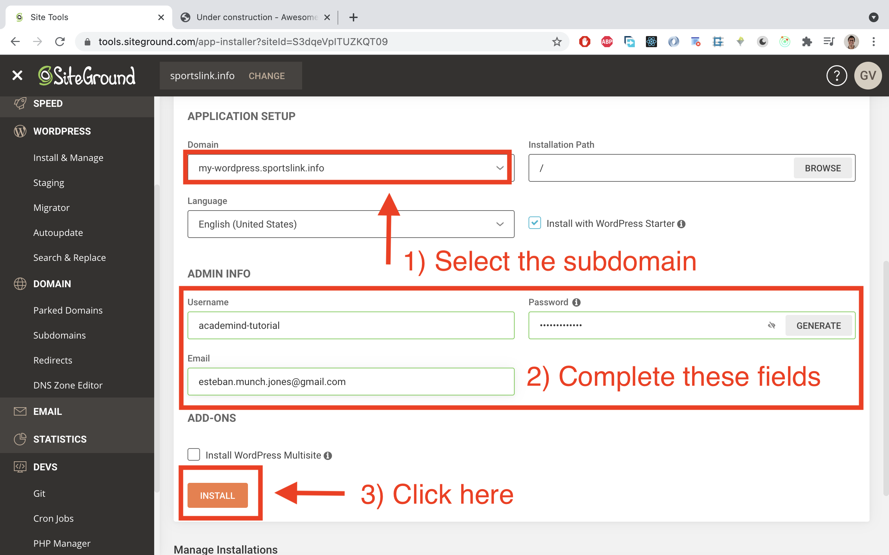


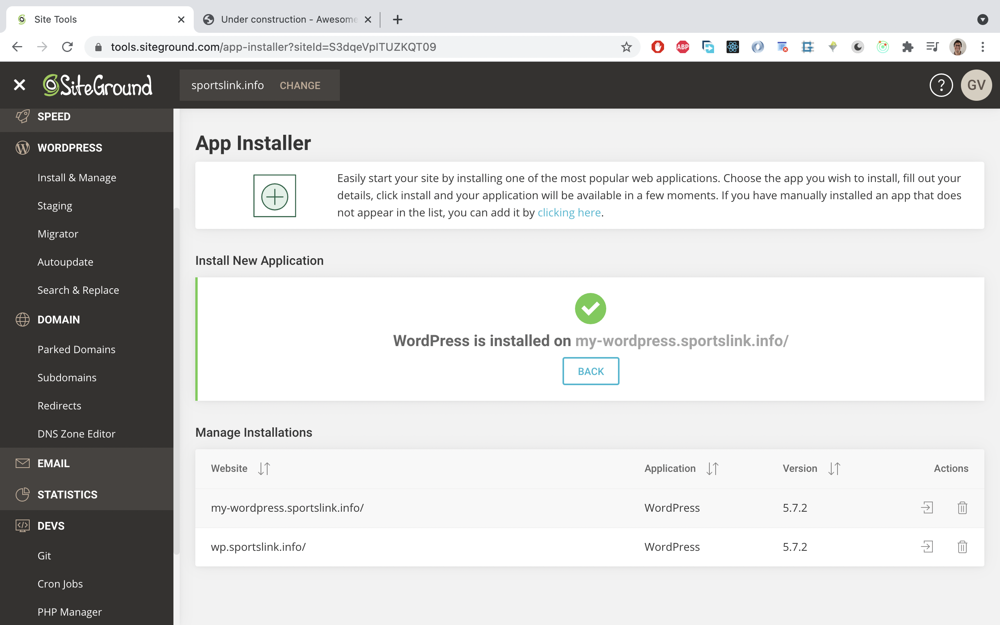


That's it! We have now successfully installed WordPress on a subdomain.


## Adding data to WordPress

The way to load data to WordPress is through the dashboard, which is a built in front end interface to interact with the backend.

To access the dashboard, just go to `your-subdomain/wp-admin`, e.g `my-wordpress.sportslink.info/wp-admin`, and enter your credentials you entered when installing it. This is how the dashboard looks like:

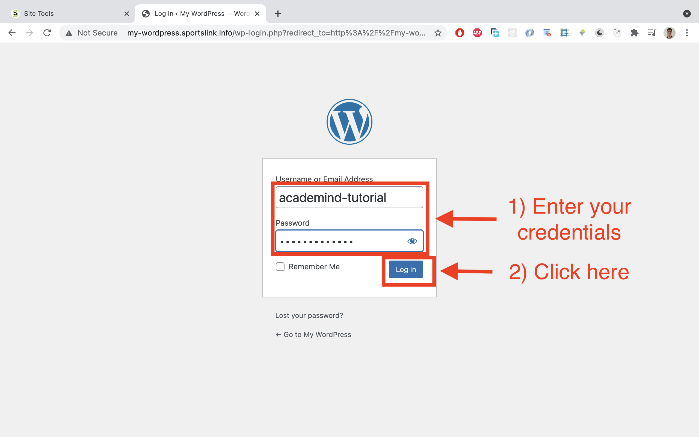


This is how the dashboard looks like:


If you wanna know more about the dashboard, check out this documentation: https://wordpress.org/support/article/dashboard-screen/


#### Writing our first post:

Let's write our first post by clicking on `Posts` and then on `Add new`:

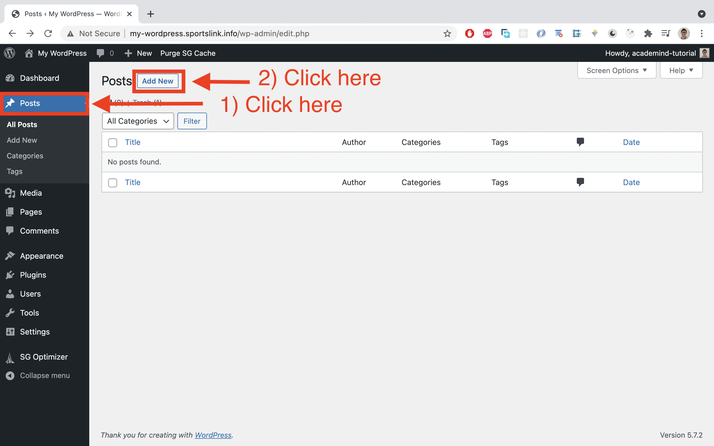


Once we get into the `post` editing section, we enter a title, and text in the body and then click publish:

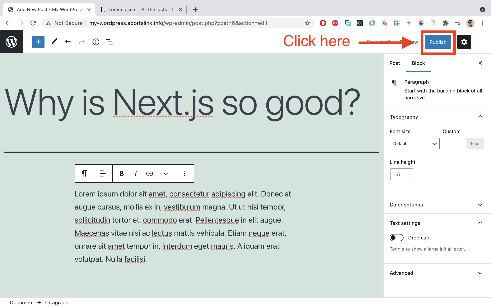

Then, we are gonna asked a second time if we want to publish it, and we click on `Publish` and we'll see an alert at the bottom of the page:

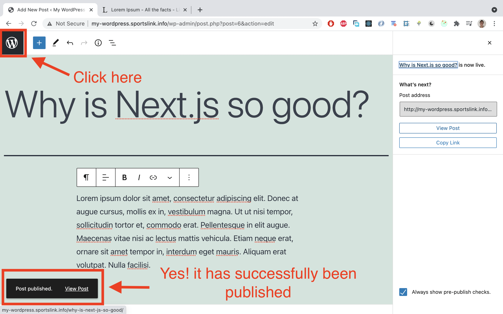

Now, we can see the list of all the post we have in our WordPress app:

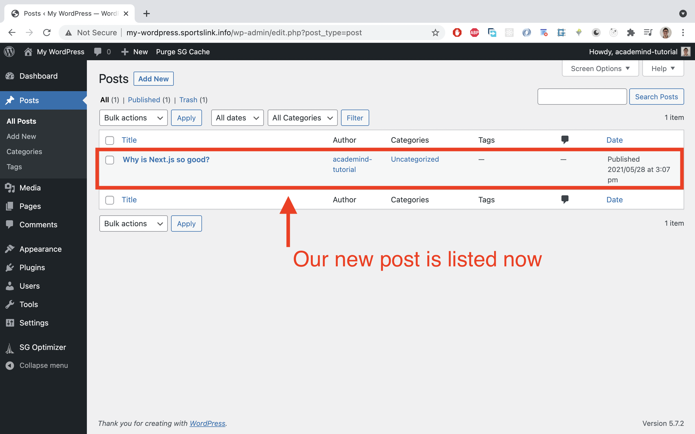


Great! we have successfully created a new post. Let's now check if it's been exposed on the api endpoint `/wp/v2/posts`, in our case, `my-wordpress.sportslink.info/`:

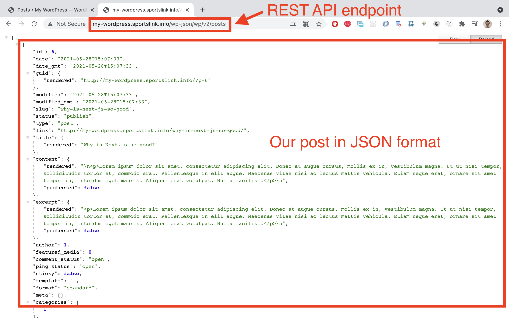

This is the JSON data obtained:

````
[
   {
      "id": 6,
      "date": "2021-05-28T15:07:33",
      "date_gmt": "2021-05-28T15:07:33",
      "guid": {
         "rendered": "http://my-wordpress.sportslink.info/?p=6"
      },
      "modified": "2021-05-28T15:07:33",
      "modified_gmt": "2021-05-28T15:07:33",
      "slug": "why-is-next-js-so-good",
      "status": "publish",
      "type": "post",
      "link": "http://my-wordpress.sportslink.info/why-is-next-js-so-good/",
      "title": {
         "rendered": "Why is Next.js so good?"
      },
      "content": {
           "rendered": "\n<p>Lorem ipsum dolor sit amet, consectetur adipiscing elit.           Donec at augue cursus, mollis ex in, vestibulum magna. Ut ut nisi tempor, sollicitudin tortor et, commodo erat. Pellentesque in elit augue. Maecenas vitae nisi ac lectus mattis vehicula. Etiam neque erat, ornare sit amet tempor in, interdum eget mauris. Aliquam erat volutpat. Nulla facilisi.<\/p>\n",
         "protected": false
      },
      "excerpt": {
         "rendered": "<p>Lorem ipsum dolor sit amet, consectetur adipiscing elit. Donec at augue cursus, mollis ex in, vestibulum magna. Ut ut nisi tempor, sollicitudin tortor et, commodo erat. Pellentesque in elit augue. Maecenas vitae nisi ac lectus mattis vehicula. Etiam neque erat, ornare sit amet tempor in, interdum eget mauris. Aliquam erat volutpat. Nulla facilisi.<\/p>\n",
         "protected": false
      },
      "author": 1,
      "featured_media": 0,
      "comment_status": "open",
      "ping_status": "open",
      "sticky": false,
      "template": "",
      "format": "standard",
      "meta": [],
      "categories": [
         1
      ],
      "tags": [],
      "_links": {
         "self": [
            {
               "href": "http://my-wordpress.sportslink.info/wp-json/wp/v2/posts/6"
            }
         ],
         "collection": [
            {
               "href": "http://my-wordpress.sportslink.info/wp-json/wp/v2/posts"
            }
         ],
         "about": [
            {
               "href": "http://my-wordpress.sportslink.info/wp-json/wp/v2/types/post"
            }
         ],
         "author": [
            {
               "embeddable": true,
               "href": "http://my-wordpress.sportslink.info/wp-json/wp/v2/users/1"
            }
         ],
         "replies": [
            {
               "embeddable": true,
               "href": "http://my-wordpress.sportslink.info/wp-json/wp/v2/comments?post=6"
            }
         ],
         "version-history": [
            {
               "count": 1,
               "href": "http://my-wordpress.sportslink.info/wp-json/wp/v2/posts/6/revisions"
            }
         ],
         "predecessor-version": [
            {
               "id": 7,
               "href": "http://my-wordpress.sportslink.info/wp-json/wp/v2/posts/6/revisions/7"
            }
         ],
         "wp:attachment": [
            {
               "href": "http://my-wordpress.sportslink.info/wp-json/wp/v2/media?parent=6"
            }
         ],
         "wp:term": [
            {
               "taxonomy": "category",
               "embeddable": true,
               "href": "http://my-wordpress.sportslink.info/wp-json/wp/v2/categories?post=6"
            },
            {
               "taxonomy": "post_tag",
               "embeddable": true,
               "href": "http://my-wordpress.sportslink.info/wp-json/wp/v2/tags?post=6"
            }
         ],
         "curies": [
            {
               "name": "wp",
               "href": "https://api.w.org/{rel}",
               "templated": true
            }
         ]
      }
   }
]
````


Our post is exposed to the world, and is ready to be consumed by any other app, like Next.js for example. Well done!


## Adding custom fields:

Inside `Posts` we have a list of default fields, like `content` and `author`, that come out of the box. What if we wanna add something custom, like the picture of the author, for example?

This can be achieved by installing a **plugin**, which is a piece of code that we plugin to our WordPress app with just a few clicks.


## Creating a new data types

What if we want to create a list of events? Events are not part of the default data types, like `Posts` are.  In WordPress, data types are called `posts`, which can be quite confusing with the actual `Posts` (blog posts). 

So, to add new data type or `post types` through a plugin. 


Adding custom fields:


