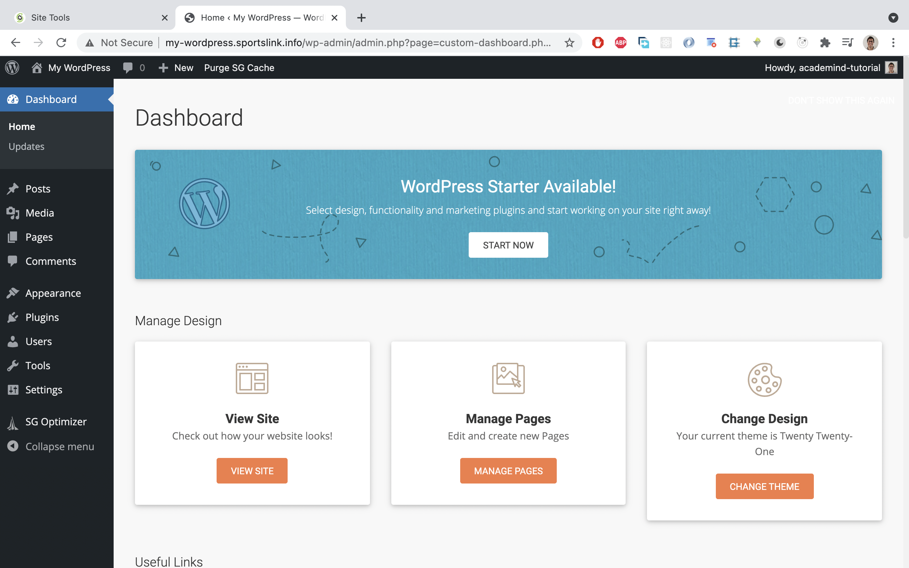
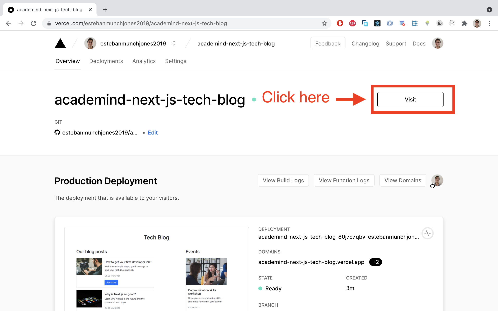
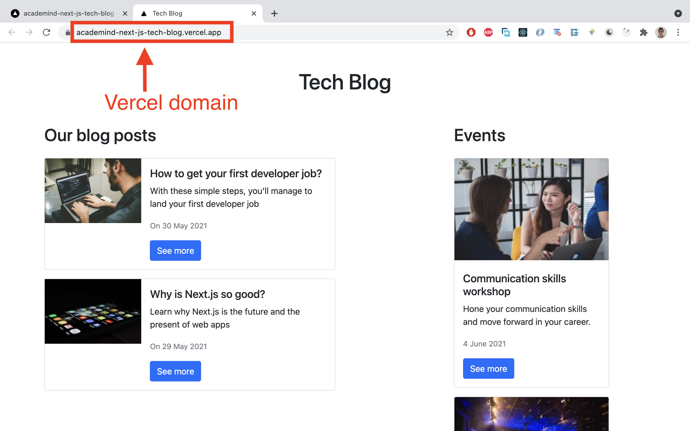

# Next.js + WordPress as headless CMS

Do you want to edit the content of your apps without touching a single line of code? 😯

In this tutorial we'll explore **Next.js, one of the best performing front end web frameworks 🚀**, and **WordPress, the most popular open source software for creating websites**. 

What other things are you gonna learn?:

✔️ How to **connect** Next.js and WordPress

✔️ How to correctly **retrieve data in Next.js** to make use of **Static Site Generation** (SSG) and **Incremental Static Regeneration** (ISR)

✔️ How to **set up WordPress on a subdomain** and **expose its data** on API endpoints.

✔️ All the steps required to get a **production app deployed to Vercel** on a **custom domain name**, so you have a recipe to deliver apps to your clients.🔥🔥

To learn all the things mentioned above, we're gonna build this demo app: https://academind-next-js-tech-blog.vercel.app/

👉 Big thanks to Gonzalo Aguirre (https://twitter.com/_gonaguirre), from Underscope (https://underscope.io/), a React Native company based in South America, for reviewing this tutorial.

This tutorial shows the technologies and steps taken to deliver this app https://www.sportslink.info/ (not finished yet) to a client in Germany 🇩🇪.

Table of contents:

**Intro**:

-[What is Next.js?](#what-is-next.js?)

-[What is SSG and ISR?](#what-is-ssg-and-isr?)

-[What is WordPress?](#what-is-wordpress?)

-[What is a headless CMS?](#what-is-a-headless-cms?)

-[The WordPress REST API](#the-wordpress-rest-api)

**Demo app**:

-[Demo app overview](#demo-app-overview)

-[Buying a domain name](#buying-a-domain-name)

-[Setting up WordPress on a subdomain](#setting-up-wordpress-on-a-subdomain)

-[Adding data to WordPress](#adding-data-to-wordpress)

-[Creating new data types](#creating-new-data-types)

​    -[Installing a plugin](#installing-a-plugin)

​    -[Adding events post type](#adding-events-post-type)

-[Adding custom fields](#adding-custom-fields)

-[Exposing custom fields in the REST API](#exposing-custom-fields-in-the-rest-api)

-[Next.js code](#next.js-code)

​    -[Making use of SSG and ISR capabilities](#making-use-of-ssg-and-isr-capabilities)

-[Deploying the Next.js app to Vercel](#deploying-the-next.js-app-to-vercel)

-[Connecting the main domain to Vercel](#connecting-the-main-domain-to-vercel)

-[Testing SSG and ISR](#testing-ssg-and-isr)

-[Fine tuning](#fine-tuning): 

​    -[Redirecting the subdomain](#redirecting-the-subdomain)

​    -[Forcing https usage on the subdomain](#forcing-https-usage-on-the-subdomain)

-[**Conclusion**](#conclusion)

## What is Next.js?

According to the creators (https://nextjs.org/).: 

*Is the React framework for production.*

*Next.js gives you the best developer experience with all the features you need for production: hybrid static & server rendering, TypeScript support, smart bundling, route pre-fetching, and more. No config needed.*

There are tons of benefits when chosing Next.js over just React, and one of the main ones is getting good SEO, because the pages of the app that are loaded in the browser are already pre-rendered on the server side. 

If this is the first time you're hearing about this framework, take a look at this basic tutorial: https://nextjs.org/learn/basics/create-nextjs-app?utm_source=next-site&utm_medium=homepage-cta&utm_campaign=next-website

If you wanna dive deeper, check out these Academind courses:

-https://www.youtube.com/watch?v=MFuwkrseXVE&ab_channel=Academind (for FREE!🥳)

-https://pro.academind.com/p/nextjs-react-the-complete-guide

## What is SSG and ISR?

**SSG** stands for **Static Site Generation.** This means that some or all the pages of the app are pre-rendered at build time, and are stored and delivered as static assets (JS, CSS and HTML files) to the browser. This is the philosophy of JamStack apps (https://jamstack.org/) which are the present and the future of web apps.

Let's think together: if the app is pre-rendered at build time, the app fetches data from their APIs and Next.js generates the HTML with that data on the server side. But...what happens if later on, the data from the API changes?

Do we need to run a new build of the app to create a fresh HTML file, so users see the new data when they load the app? No. Thankfully, Next.js provides a solution for us: **Incremental Site Regeneration (ISR)**.

According to the docs (https://nextjs.org/docs/basic-features/data-fetching#incremental-static-regeneration):

*Next.js allows you to create or update static pages **after** you’ve built your site. Incremental Static Regeneration (ISR) enables you to use static-generation on a per-page basis, **without needing to rebuild the entire site**. With ISR, you can retain the benefits of static while scaling to millions of pages.*

We'll explore how to make use of these tools in later sections, when we'll build a demo app.

## What is WordPress?

According to them (https://wordpress.org/), *WordPress is open source software you can use to create a beautiful website, blog, or app.*

Let's look at some numbers to see how used this software is in the real world:

*WordPress is now **powering 39.5% of all websites in 2021**, up from powering 35% of sites in 2020. Counting only sites that use a content management system (CMS), WordPress has a market share of 64.1%.* (source: https://www.searchenginejournal.com)

Why not using the most popular tech to build an app? Using something mainstream has the advantage of getting **good support**, **tons of answered questions online**, and besides that, it can be hosted in a server at a **really low cost**.

In a nutshell, WordPress is a bunch of PHP files and MySQL databases, installed on a Linux server, using **Apache** (the most commonly used Web server on **Linux** systems).  This software can be used to store data and create HTML files which are translated into pages that users can interact with in the browser.

Note: WordPress can also run on Windows and Mac, and this is the case when developing wordpress sites locally. Then, when on production, most web servers use Linux.

## What is a Headless CMS?

A headless CMS (Content Management System) is just using the back end part of a full stack app, that can expose functionality and data through REST or GraphQL endpoints (URLs).

So, **instead of using WordPress for storing data and creating the HTML, we just only use it for storing and exposing data, and then we use Next.js or any other framework to create the HTML instead, and be in charge of the front end part of the app.**

In our case, it will be Next.js making requests to these endpoints.

## The WordPress REST API:

The WordPress REST API provides an interface for applications to interact with your WordPress back end by sending and receiving data as [JSON](https://en.wikipedia.org/wiki/JSON) (JavaScript Object Notation) objects (https://developer.wordpress.org/rest-api/).

So this API is a collection of URLs or endpoints we can hit to access data stored in WordPress from any type of app that can make http requests, front end or back end apps, like Django, Ruby, Laravel app, etc.

To make things more clear, let's look at the some of the available endpoints available by default (https://developer.wordpress.org/rest-api/reference/):

-`/wp/v2/posts`

-`/wp/v2/media`

Let's take a look at a famous website that uses WordPress: https://www.bbcamerica.com/ and try to access data that they have stored in the back end of the WordPress software.

To access the endpoints of the REST API, all we need to do is to make an http request to `{domain}/wp-json/{endpoint}`. For example, try navigating to this url: https://www.bbcamerica.com/wp-json/wp/v2/media to see all the `media` the BBC America has stored on WordPress. Pretty awesome, isn't it?

The response we get when hitting the above URL has this shape: `[{},{},..]`.

It's basically an array of objects, that have links to media (like this one:https://images.amcnetworks.com/bbcamerica.com/wp-content/uploads/2021/05/Colin-Farrell-300x169.jpg), which are part of the `media` collection in the back end.

BBC America has decided to use WordPress as a full stack app, because besides using it to store data, it's being used to generate the HTML that users see when hitting https://www.bbcamerica.com/, but they can also use a front end framework like Next.js in the future, to provide users with faster navigation and better user experience if they want to, just by using the REST API already in place.

## Demo app overview

Enough of theory. 

Let's now build a Next.js demo app and connect it to a WordPress back end, so you can see the full potential of this tech stack combo. 

The Next.js app is deployed here: https://academind-next-js-tech-blog.vercel.app/, and the WordPress back end is installed here: https://my-wordpress.sportslink.info/.

The code of the Next.js app can be found here: https://github.com/estebanmunchjones2019/academind-next.js-tech-blog.

The Next.js app displays tech `blog posts` and `events`, and it uses SSG and ISR technology, deployed on Vercel (https://vercel.com/).

## Buying a domain name

As this tutorial is about deploying an app to custom domain, let's start by buying one.

There are tons of places where we can buy a domain name. Feel free to explore for hosting services + domain providers. You can check out a list of them here: https://www.wpbeginner.com/wordpress-hosting/

In this article we'll use Siteground (https://www.siteground.co.uk/) to buy domain name and use their wordpress hosting service, all in one purchase.

There are many plans to choose from (https://www.siteground.co.uk/wordpress-hosting.htm):


Then, when checking out, you can buy a domain name:


## Setting up WordPress on a subdomain

After finishing the purchase, the next step is to create a subdomain, but...why?

The idea is to buy a domain name, e.g `sportslink.info`, and then **create a subdomain to install WordPress there**, e.g `my-wordpress.sportslink.info`, and use the main domain `sportslink.info` on Vercel, to display the Next.js front end app.

Using a subdomain has the benefit of **"pay once, use twice"** approach because **the subdomain it's for free**. You can have as many subdomains as you want. There is no point on buying one domain name for the backend (WordPress) and another domain for the front end (Next.js app).

Here are the steps to create a subdomain:


As you can see, there was an already created subdomain `wp`, which is beeing used in production for this app https://www.sportslink.info/. The new subdomain created is called `my-wordpress`.


That's it! We have now successfully installed WordPress on a subdomain!

## Adding data to WordPress

The way to load data to WordPress is through the dashboard, which is a built in front end interface to interact with the backend.

To access the dashboard, just go to `your-subdomain/wp-admin`, e.g `my-wordpress.sportslink.info/wp-admin`, and enter the credentials you set up when installing it. This is how the dashboard looks like:


This is how the dashboard looks like:



If you wanna know more about the dashboard, check out this documentation: https://wordpress.org/support/article/dashboard-screen/

#### Writing our first post:

Let's write our first post by clicking on `Posts` and then on `Add new`:


Once we get into the `post` editing section, we enter a title and text in the body, and then click on `Publish`:


Then, we're gonna be asked a second time if we want to publish it, and we click on `Publish` again and we'll see an alert at the bottom of the page confirming the publishing:


Now, we can see the list of all the post we have in our WordPress app:


Great! we have successfully created a new post. Let's now check if it's been exposed on the api endpoint `/wp/v2/posts`, in our case, `my-wordpress.sportslink.info`:


This is the JSON data obtained:

```
[
   {
      "id": 6,
      "date": "2021-05-28T15:07:33",
      "date_gmt": "2021-05-28T15:07:33",
      "guid": {
         "rendered": "http://my-wordpress.sportslink.info/?p=6"
      },
      "modified": "2021-05-28T15:07:33",
      "modified_gmt": "2021-05-28T15:07:33",
      "slug": "why-is-next-js-so-good",
      "status": "publish",
      "type": "post",
      "link": "http://my-wordpress.sportslink.info/why-is-next-js-so-good/",
      "title": {
         "rendered": "Why is Next.js so good?"
      },
      "content": {
           "rendered": "\n<p>Lorem ipsum dolor sit amet, consectetur adipiscing elit.           Donec at augue cursus, mollis ex in, vestibulum magna. Ut ut nisi tempor, sollicitudin tortor et, commodo erat. Pellentesque in elit augue. Maecenas vitae nisi ac lectus mattis vehicula. Etiam neque erat, ornare sit amet tempor in, interdum eget mauris. Aliquam erat volutpat. Nulla facilisi.<\/p>\n",
         "protected": false
      },
      "excerpt": {
         "rendered": "<p>Lorem ipsum dolor sit amet, consectetur adipiscing elit. Donec at augue cursus, mollis ex in, vestibulum magna. Ut ut nisi tempor, sollicitudin tortor et, commodo erat. Pellentesque in elit augue. Maecenas vitae nisi ac lectus mattis vehicula. Etiam neque erat, ornare sit amet tempor in, interdum eget mauris. Aliquam erat volutpat. Nulla facilisi.<\/p>\n",
         "protected": false
      },
      "author": 1,
      "featured_media": 0,
      "comment_status": "open",
      "ping_status": "open",
      "sticky": false,
      "template": "",
      "format": "standard",
      "meta": [],
      "categories": [
         1
      ],
      "tags": [],
      "_links": {
         "self": [
            {
               "href": "http://my-wordpress.sportslink.info/wp-json/wp/v2/posts/6"
            }
         ],
         "collection": [
            {
               "href": "http://my-wordpress.sportslink.info/wp-json/wp/v2/posts"
            }
         ],
         "about": [
            {
               "href": "http://my-wordpress.sportslink.info/wp-json/wp/v2/types/post"
            }
         ],
         "author": [
            {
               "embeddable": true,
               "href": "http://my-wordpress.sportslink.info/wp-json/wp/v2/users/1"
            }
         ],
         "replies": [
            {
               "embeddable": true,
               "href": "http://my-wordpress.sportslink.info/wp-json/wp/v2/comments?post=6"
            }
         ],
         "version-history": [
            {
               "count": 1,
               "href": "http://my-wordpress.sportslink.info/wp-json/wp/v2/posts/6/revisions"
            }
         ],
         "predecessor-version": [
            {
               "id": 7,
               "href": "http://my-wordpress.sportslink.info/wp-json/wp/v2/posts/6/revisions/7"
            }
         ],
         "wp:attachment": [
            {
               "href": "http://my-wordpress.sportslink.info/wp-json/wp/v2/media?parent=6"
            }
         ],
         "wp:term": [
            {
               "taxonomy": "category",
               "embeddable": true,
               "href": "http://my-wordpress.sportslink.info/wp-json/wp/v2/categories?post=6"
            },
            {
               "taxonomy": "post_tag",
               "embeddable": true,
               "href": "http://my-wordpress.sportslink.info/wp-json/wp/v2/tags?post=6"
            }
         ],
         "curies": [
            {
               "name": "wp",
               "href": "https://api.w.org/{rel}",
               "templated": true
            }
         ]
      }
   }
]
```

Our post is exposed to the world, and is ready to be consumed by any other app, like Next.js for example. Well done👏!

## Creating new data types

What if we want to create an array of `events` and expose it on the REST API? `Events` are not part of the default data types, like `Posts` are. 

In WordPress, data types are called `posts`, which can be quite confusing with the actual `Posts` (blog posts). For instance: if we have `events`, `meetings`, `products`, `offers`, they are all `posts` (of different types) in the WordPress world. 

So, let's add new data type or `post type` by installing a **plugin**, which is a piece of code that we plugin to our WordPress app with just a few clicks.

👉 **Update**: there's a **new free plugin** that simplifies all the steps below to add custom data types and fields, and it's called `Atlas Content Modeler` https://wordpress.org/plugins/atlas-content-modeler/
So you might want to use `Atlas Content Modeler` instead of `Custom Post Type UI` + `Advanced Custom Fields` + `ACF to REST API`. Quite a good deal, isn't it? 😉

#### Installing a plugin

These are the steps for installing the `Custom Post Type UI` plugin by `WebDevStudios`:


#### Adding `events` post type

We are now ready to add `events` as a new post type.

After activating this plugin, some new functionality has been added to our WordPress installation: the dashboard has a new tab called `CPT UI`. Let's follow these steps to finally add `events`:


Make sure `Show in REST API` is set to `True`, and then select any name you want for the REST API enpoint for `events`. In this case, `events` has been chosen, so the array of `events` is gonna be retrievable at `subdomain/wp-json/wp/v2/events`.


Let's now add a new event:


And follow the same pattern we used for writing a new `Post` at the beginning. By default, the `Events` editing page looks the same as `Posts`, where we can write a title and body. Here is an example of an event:


 Create a title and a body and then publish it.

Let's test if we get an array of events when hitting: `my-wordpress.sportslink.info/wp-json/wp/v2/events`.


## Adding custom fields

So far so good, but...**an event should have a date and location**, shouldn't it?

By default, our new `event` post type doesn't have any fields that let us load this data we want.

Once again, a plugin comes to solve a problem: let's install `Advanced Custom Fields`, by `Elliot Condon`. 

Once installed, let's use it:


Well done! it took some time to set it up, but we can now see if these 2 fields appear when we try to edit/update an `event`.

Let's try updating the already created `event` called `Web dev conference`:


#### Exposing custom fields in the REST API

By default, custom fields are not exposed in the REST API, so we need a new...(you guessed it!)...plugin, to  make this happen without the need of writing code. The plugin we need to install and activate is `ACF to REST API` by `Aires Gonçalves`.

Let's now check that REST API for `events`, by going to `my-wordpress.sportslink.info/wp-json/wp/v2/events`:


👉 Challenge for you here:

There are a few things you can try on your own:

- Upload a `Featured Image` for `Events` and `Posts`. (Hint: when creating or editing them, look on your right).
- Add an `Excerpt` for `Events`, manually with `CPT UI` functionality.
- Change the output of the `date` field for `Events` to match your date format needs, manually with `Custom Fields` functionality.

If you can't find your way around, Google it and you will find your solution, or give a shout on the Academind Discord Group: https://discord.com/invite/gxvEWGU

👉 **Update**: Do you want to expose your WordPress data with GraphQL? No problem! use `WPGraphQL` plugin https://www.wpgraphql.com/.

## Next.js code

Enough of WordPress. 

Let's now jump into Next.js. All the technical info you need to build this demo app is here: https://nextjs.org/

In a folder, create a new Next.js project by running this on the terminal:

```bash
npx create-next-app
```

And let's name it `tech-blog`:

```bash
✔ What is your project named? … tech-blog
```

The structure of the main files and folder is as following:

```bas
/pages
    _app.js
    index.js
    /posts
        [slug].js
    /events
        [slug].js

/components
    Post.js
    Event.js

/utils
    wordpress.js
    utils.js

next.config.js    
```

This is the content of each file:

```javascript
//_app.js

import '../styles/globals.css'
import Head from 'next/head'

function MyApp({ Component, pageProps }) {
  return (
    <>
      <Head>
        {/* you can add metadata here, for all pages */}
        <link href="https://cdn.jsdelivr.net/npm/bootstrap@5.0.0-    beta3/dist/css/bootstrap.min.css" rel="stylesheet" integrity="sha384-eOJMYsd53ii+scO/bJGFsiCZc+5NDVN2yr8+0RDqr0Ql0h+rP48ckxlpbzKgwra6" crossOrigin="anonymous" />
      </Head>
      <Component {...pageProps} />
    </>
  )

}

export default MyApp
```

```javascript
//index.js


import Head from 'next/head'

import { getEvents, getPosts } from '../utils/wordpress';

import Post from "../components/Post";
import Event from "../components/Event";

export default function Home({posts, events}) {

  const jsxPosts = posts.map(post => {
    const featuredMedia = post['_embedded']['wp:featuredmedia'][0];
    return (
      <Post post={post} featuredMedia={featuredMedia} key={post.id}/>
    )
  });

  const jsxEvents = events.map(event => {
    const featuredMedia = event['_embedded']['wp:featuredmedia'][0];
    return (
      <Event event={event} featuredMedia={featuredMedia} key={event.id}/>
    )
  });

  return (
    <>
      <Head>
        <title>Tech Blog</title>
        <meta name="description" content="Keep up to date with the latest trends in tech" />
        <link rel="icon" href="/favicon.ico" />
        {/* You can add more metadata here, like open graph tags for social media, etc */}
      </Head>

      <div className="container pt-5">
        <h1 className="text-center pb-5">Tech Blog</h1>
        <div className="row">
          <div className="col-lg-8">
            <h2 className="pb-3">Our blog posts</h2>
            {jsxPosts}
          </div>
          <div className="col-lg-4">
            <h2 className="pb-3">Events</h2>
            {jsxEvents}
          </div>
        </div>
      </div>
    </>
  )

}

export async function getStaticProps({ params }) {

  const posts = await getPosts();
  const events = await getEvents();
  return {
    props: {
     posts,
     events
    },
    revalidate: 10, // In seconds
  }

}

```

```javascript
// /posts/[slug].js

import Link from "next/link";

import {getPost, getSlugs} from "../../utils/wordpress";

export default function PostPage({post}){
    return (
        <div className="container pt-5">
            <h1 className="text-center pb-5">{post.title.rendered}</h1>
            <div className="card-text pb-5" dangerouslySetInnerHTML={{__html: post.content.rendered}}></div>
            <Link href="/">
                <a className="btn btn-primary">Back to Home</a>
            </Link>
        </div>
    )
}

//hey Next, these are the possible slugs
export async function getStaticPaths() {

    const paths = await getSlugs("posts");

    return {
        paths,
        //this option below renders in the server (at request time) pages that were not rendered at build time
        //e.g when a new blogpost is added to the app
        fallback: 'blocking'
    }

  }

 //access the router, get the id, and get the data for that post 
 export async function getStaticProps({ params }) {

   const post = await getPost(params.slug);

   return {
     props: {
       post
     },
     revalidate: 10, // In seconds
   }

 }
```

```javascript
// /events/[slug].js

import Link from "next/link";

import {getEvent, getSlugs} from "../../utils/wordpress";

export default function EventPage({event}){
    return (
        <div className="container pt-5">
            <h1 className="text-center pb-5">{event.title.rendered}</h1>
            <div className="card-text pb-5" dangerouslySetInnerHTML={{__html: event.content.rendered}}></div>
            <Link href="/">
                <a className="btn btn-primary">Back to Home</a>
            </Link>
        </div>
    )
}

  //hey Next, these are the possible slugs
export async function getStaticPaths() {

    const paths = await getSlugs("events");

    return {
        paths,
        //this option below renders in the server (at request time) pages that were not rendered at build time
        //e.g when a new blogpost is added to the app
        fallback: 'blocking'
    }

  }

  //access the router, get the id, and get the medatada for that post

  export async function getStaticProps({ params }) {

    const event = await getEvent(params.slug);

    return {
      props: {
        event
      },
      revalidate: 10, // In seconds
    }

  }
```

```javascript
// /components/Post.js


import Link from "next/link";
import Image from "next/image";
//to use Image with an external url, add some config on next.config.js
//for more info, check out these docs https://nextjs.org/docs/basic-features/image-optimization

import {getDate} from "../utils/utils";

export default function Post({post, featuredMedia}) {

    return (
        <div className="card mb-3" style={{maxWidth: "540px"}}>
            <div className="row g-0">
                <div className="col-md-4">
                    <Link href={`/posts/${post.slug}`}>
                        <a>
                            <Image src={featuredMedia["media_details"].sizes.medium["source_url"]} width={180} height={120} alt={featuredMedia["alt_text"]}/>
                        </a>
                    </Link>
                </div>
                <div className="col-md-8">
                    <div className="card-body">
                        <h5 className="card-title">{post.title.rendered}</h5>
                        <div className="card-text" dangerouslySetInnerHTML={{__html: post.excerpt.rendered}}></div>
                        <p className="card-text"><small className="text-muted">On {getDate(post.modified)}</small></p>
                        <Link href={`/posts/${post.slug}`}>
                            <a className="btn btn-primary">See more</a>
                        </Link>
                    </div>
                </div>
            </div>
        </div>
    )

}
```

```javascript
// /components/Event.js

import Link from "next/link";
import Image from "next/image";
//to use Image with an external url, add some config on next.config.js
//for more info, check out these docs https://nextjs.org/docs/basic-features/image-optimization


export default function Event({event, featuredMedia}) {
    return (
        <div className="card mb-3" style={{width: "18rem"}}>
            <Link href={`/events/${event.slug}`}>
                <a>
                    <Image src={featuredMedia["media_details"].sizes.medium["source_url"]} width={288} height={190} alt={featuredMedia["alt_text"]} className="card-img-top"/>
                </a>
            </Link>
            <div className="card-body">
                <h5 className="card-title">{event.title.rendered}</h5>
            <div className="card-text" dangerouslySetInnerHTML={{__html: event.excerpt.rendered}}></div>
                <p className="card-text"><small className="text-muted">{(event.acf.date)}</small></p>
                <Link href={`/events/${event.slug}`}>
                    <a className="btn btn-primary">See more</a>
                </Link>
            </div>
        </div> 
    )
}
```

```javascript
// /utils/wordpress.js


const BASE_URL = "https://my-wordpress.sportslink.info/wp-json/wp/v2";

export async function getPosts() {
  const postsRes = await fetch(BASE_URL + "/posts?_embed");
  const posts = await postsRes.json();
  return posts;
}

export async function getPost(slug) {
  const posts = await getPosts();
  const postArray = posts.filter((post) => post.slug == slug);
  const post = postArray.length > 0 ? postArray[0] : null;
  return post;
}
export async function getEvents() {
  const eventsRes = await fetch(BASE_URL + "/events?_embed");
  const events = await eventsRes.json();
  return events;
}

export async function getEvent(slug) {
  const events = await getEvents();
  const eventArray = events.filter((event) => event.slug == slug);
  const event = eventArray.length > 0 ? eventArray[0] : null;
  return event;
}

export async function getSlugs(type) {
  let elements = [];
  switch (type) {
    case "posts":
      elements = await getPosts();
      break;
    case "events":
      elements = await getEvents();
      break;
  }
  const elementsIds = elements.map((element) => {
    return {
      params: {
        slug: element.slug,
      },
    };
  });
  return elementsIds;
}

```

```javascript
// utils/utils.js

export function getDate(date){
    return new Date(date).toLocaleDateString('en-GB', {
        day: 'numeric',
        month: 'short',
        year: 'numeric',
      });
}
```

```javascript
// next.config.js

module.exports = {
    images: {
        //enter the domain or subdomain where you have WordPress installed 
      domains: ['my-wordpress.sportslink.info'],
    },
}
```

👉 **Update**: big thanks to Ivo Pereira, for flagging an issue https://github.com/estebanmunchjones2019/academind-next.js-tech-blog/issues/1 on the demo app. You can follow him on https://github.com/hivvu. 

The changes implemented to solve that issue are the addition of a url param `?_embed` when calling the WordPress endpoints. This way, we get the `featuredMedia` image of each `post` embedded, and that avoids an extra call to `/media` endpoint to get that image.

#### Making use of SSG and ISR capabilities

Using `getStaticProps` inside every page brings the benefit of having the data fetched at build time and that way, we get a static page.

On each page that has a dynamic url, like `[slug].js`, inside `getStaticPaths` a key value pair config `fallback: 'blocking'` is passed, so if a user requests a newly created post after the Next app was built, Next.js will automatically create that page on the fly on the server side and serve it to the user, and then, that page will be cached for future requests so the build process only happens once per path. You can learn more about it here: https://nextjs.org/docs/basic-features/data-fetching.

## Deploying the Next.js app to Vercel

What a better place to deploy your app that the platform of the creators of Next.js?

This platform is called Vercel, and you need to sign up in order to host your app there: https://vercel.com/signup

Follow their instructions, which are easy to follow, to set up your account and connect your github account to it.

One nice feature of Vercel is that you can link a gitHub repo and get automatic builds every time new code is pushed to it. 

Let's connect the demo app repo to Vercel:


If there were no errors on the deployment step, then, you should see this on your dashboard:





Well done! now your app can be shared with the world!

## Connecting the main domain to vercel

It's now time to connect a custom domain name, like `sportslink.info` to the app already deployed to Vercel.


Then, you'll need to do a series of steps to connect the custom domain name to Vercel:

- Copy `A` and `CNAME` records from your vercel Project inside `settings/domains`.

- Go to your domain name provider (in this case SiteGround) and access the `DNS zone editor`. 

- Delete default `A` records for sportslink.info and www.sportslink.info

- Add a `A` and `CNAME` records just for the MAIN DOMAIN (in this case,`sportslink.info`) with the data we copied form the Vercel dashboard.

The A anc CNAME records should look like this:


Pro tip: use this tool to check if changes in the DNS records have been propagated: https://www.digwebinterface.com/

After some time, you should be able to enter your domain name on the browser and finally see your Next.js app deployed there. The Vercel dashboard in  `settings/domains ` should look like this:


Well done!! 👏. It's being a long journey to set up WordPress, build the Next.js app, deploy it and connect it to a custom domain. Good effort! 💪

## Testing SSG and ISR

The easiest way to test that you're making use of SSG and ISR is to look at the `build log`:


To test ISR, after your last deploy to Vercel, go to WordPress app and create a new post. Then, go to your depoyed Next.js app url, and click on the new post you created. If the route `posts/{your-new-post-slug}` shows the new post, ISR is working well! Otherwise, you would get a `404` default message, because that page hadn't been created at build time and couldn't be found in your static assets.

## Fine tuning

#### Redirecting the subdomain:

If we now access the subdomain were WordPress is installed we get this:


We don't want users to see the app content on the subdomain. To solve this issue, we first need to know which `theme` is being applied:


Once we know the active theme, which `Twenty Twenty-One` in this example, we can now go to the `File Manager` on SiteGround, and modify the content of the `twentytwentyone` folder.

The idea is to write some code that redirects the users to the main domain (where the Next.js app lives) when they accidentally try to access the subdomain.


Delete all the content of the the `twentytwentyone` folder, and create 2 new files, called `index.php` and `style.css`, which are the 2 required files to create a theme in WordPress. Paste this content in those files:

```html
<!-- index.php -->

<meta content="0; URL='https://sportslink.info''" http-equiv"refresh">

<!-- just in case the meta tag is not read properly, here is plan B: a JS redirect -->
<script type="text/javascript">
  window.location = 'https://sportslink.info';
</script>
```

```css
/*style.css*/

/*
Theme Name: Twenty Twenty-One
Author: Esteban Munch Jones
*/
```

Of course, replace `sportslink.info` with your own main domain name and the author's name with yours.

#### Forcing https usage on the subdomain:

Let's take a look at the browser when we load the dashboard of the WordPress installation on the subdomain:


To enforce `https` usage on the subdomain, we need to go to the hosting provider, in this case SiteGround, and follow these steps:


Make sure you change the `BASE_URL` on the `wordpress.js` file in the Next.js app:

```javascript
// /utils/wordpress.js

//Replace:
const BASE_URL = "http://my-wordpress.sportslink.info/wp-json/wp/v2";

//with this:
const BASE_URL = "https://my-wordpress.sportslink.info/wp-json/wp/v2";
```

## Conclusion

After following this tutorial, you now have all the tools you need to provide a modern experience to the app users thanks to Next.js and, at the same time, give the app content editor the ability to edit content in an easy way using the WordPress dashboard.

The price of the hosting WordPress makes it affordable for small projects, without the need of spending tons of money. 

The final advantage is the big online community around Next.js and WordPress, so if you get stuck at some point, the answer will be at the tip of your fingers through a Google search.

Congratulations on following this extense tutorial!🥳

💻Happy coding!💻
